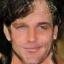
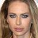

# DiscoGAN-Paddle
Re-implement DiscoGAN in Paddle

基于 pytorch 源码：https://github.com/SKTBrain/DiscoGAN

## 模型对齐

详见 `DiscoGAN-Paddle/pipeline/`

- Step1 模型结构对齐
- Step2 损失函数对齐
- Step3 反向传播对齐

> 可视化效果，无指标计算。

## 环境依赖

- python 3.7
- paddle 2.1

## 快速开始

### Train

- **单卡：**
    
    ```
    python DiscoGAN-Paddle/discogan/image_translation.py \
        --image_dir path/to/img_align_celeba \
        --attr_file path/to/list_attr_celeba.txt \
        --task_name celebA \
        --style_A Male \
        --n_test 200 \
        --batch_size 200 \
        --epoch_size 2000 \
        --result_path ./results \
        --model_path ./models \
        --log_out ./logs \
        --ckpt_path path/to/discoGAN.pdparams \
        --local_rank -1 \
        --num_workers 4 \
        --learning_rate 0.0002
    ```
    
- **单机 4 卡：**

AI Studio 脚本训练：`train.sh`
    ```shell script
    #!/bin/bash
    
    CELEBA=/root/paddlejob/workspace/train_data/datasets/data107578/img_align_celeba.zip
    ATTR_TXT=/root/paddlejob/workspace/train_data/datasets/data107578/list_attr_celeba.txt
    
    TO_DIR=/root/paddlejob/workspace/train_data/datasets/
    IMG_CELEBA=/root/paddlejob/workspace/train_data/datasets/img_align_celeba
    CKPT=/root/paddlejob/workspace/train_data/datasets/data107578/discoGAN5.9999.pdparams
    
    unzip -d $TO_DIR $CELEBA
    
    LOGDIR=/root/paddlejob/workspace/log/train_log
    OUTDIR=/root/paddlejob/workspace/output/model_imgs
    
    python -m paddle.distributed.launch --gpus '0,1,2,3' DiscoGAN-Paddle/discogan/image_translation.py \
        --image_dir $IMG_CELEBA \
        --attr_file $ATTR_TXT \
        --task_name celebA \
        --style_A Male \
        --n_test 200 \
        --batch_size 200 \
        --epoch_size 2000 \
        --result_path $OUTDIR \
        --model_path $OUTDIR \
        --log_out $LOGDIR \
        --local_rank 0 \
        --num_workers 4 \
        --learning_rate 0.0006 \
        --ckpt_path $CKPT \
        --iters 60000  # 预训练模型已经训练的迭代数
    ```

### Test

*现在训练了 gender 转换的模型*

- 加载模型:

```
python DiscoGAN-Paddle/discogan/evaluation.py \
  --image_dir path/to/img_align_celeba \
  --attr_file path/to/list_attr_celeba_demo.txt \
  --n_test 10 \
  --task_name celebA \
  --style_A Male \
  --batch_size 1 \
  --ckpt_path path/to/discoGAN.pdparams
```

样例如下：

|A|AB|ABA|
| --- | --- | ---|
||||
||||

> 详见 `./assets/figs`